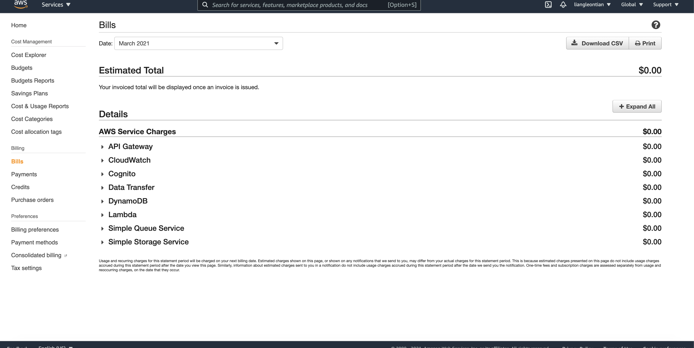

# Link to the Notes App Client repo:
[`https://github.ccs.neu.edu/CS-7680-SEA-Spring2021/LiangTian-Serverless-NotesAppClient`](https://github.ccs.neu.edu/CS-7680-SEA-Spring2021/LiangTian-Serverless-NotesAppClient)

# Checkpoint updates

## Checkpoint 3
- A brief description
  
  In this section, I leverage the React Router to handle routes and 404s, tap into AWS Amplify for allowing our users to login and sign up for the app. To do this I create a login page and a signup page and connect it up with our AWS Cognito setup. And I create pages for notes creating, listing, updating, and deleting, and create a setting page connecting the billing form. In the last part, I create a route and secured pages that redirects, and host the React App to AWS S3 and CloudFront.

#### Link to the deployed app on AWS
[`http://d1jp052a5pxs5w.cloudfront.net/`](http://d1jp052a5pxs5w.cloudfront.net/)

- Login window visible


- User logged in and creating a note


- Notes list page


- Screenshot of AWS billing dashboard displaying costs so far 


## Checkpoint 2
- A brief description
  
  In this section, I leverage AWS Cognito user pool and identity pool to authenticate and authorize users of the serverless APIs, tap into Stripe API for billing service, add unit test section, handle CORS in Serverless APIs, API Gateway CORS errors and in S3 for File Uploads, and setup a React app, customize the favicons fonts and add bootstrap for it.

- A screenshot of terminal after running npm test


- A screenshot of browser displaying the web application


- A screenshot of AWS billing dashboard 


## Checkpoint 1
- A brief description

  In this part so far, I’ve configured AWS account and AWS CLI, set up the Serverless Framework, created a database (DynamoDB), created an S3 bucket for file uploads, and built and deployed create, get, list, update and delete APIs.

- A screenshot of your DynamoDB table in the AWS console


- A screenshot of your browser displaying the list notes API endpoint


- A screenshot of your AWS billing dashboard 


- Working links to the 5 defined API endpoints
  - Create a note: [POST] - https://aabh7pe7yl.execute-api.us-east-1.amazonaws.com/prod/notes
  - Get a note: [GET] - https://aabh7pe7yl.execute-api.us-east-1.amazonaws.com/prod/notes/{id}
  - List notes: [GET] - https://aabh7pe7yl.execute-api.us-east-1.amazonaws.com/prod/notes
  - Update a note: [PUT] - https://aabh7pe7yl.execute-api.us-east-1.amazonaws.com/prod/notes/{id}
  - Delete a note: [DELETE] - https://aabh7pe7yl.execute-api.us-east-1.amazonaws.com/prod/notes/{id}

# Serverless Node.js Starter

A Serverless starter that adds ES6, TypeScript, serverless-offline, linting, environment variables, and unit test support. Part of the [Serverless Stack](http://serverless-stack.com) guide.

[Serverless Node.js Starter](https://github.com/AnomalyInnovations/serverless-nodejs-starter) uses the [serverless-bundle](https://github.com/AnomalyInnovations/serverless-bundle) plugin and the [serverless-offline](https://github.com/dherault/serverless-offline) plugin. It supports:

- **Generating optimized Lambda packages with Webpack**
- **Using ES6 or TypeScript in your handler functions**
- **Run API Gateway locally**
  - Use `serverless offline start`
- **Support for unit tests**
  - Run `npm test` to run your tests
- **Sourcemaps for proper error messages**
  - Error message show the correct line numbers
  - Works in production with CloudWatch
- **Lint your code with ESLint**
- **Add environment variables for your stages**
- **No need to manage Webpack or Babel configs**

---

### Demo

A demo version of this service is hosted on AWS - [`https://z6pv80ao4l.execute-api.us-east-1.amazonaws.com/dev/hello`](https://z6pv80ao4l.execute-api.us-east-1.amazonaws.com/dev/hello)

And here is the ES6 source behind it

``` javascript
export const hello = async (event, context) => {
  return {
    statusCode: 200,
    body: JSON.stringify({
      message: `Go Serverless v1.0! ${(await message({ time: 1, copy: 'Your function executed successfully!'}))}`,
      input: event,
    }),
  };
};

const message = ({ time, ...rest }) => new Promise((resolve, reject) =>
  setTimeout(() => {
    resolve(`${rest.copy} (with a delay)`);
  }, time * 1000)
);
```

### Upgrading from v1.x

We have detailed instructions on how to upgrade your app to the v2.0 of the starter if you were using v1.x before. [Read about it here](https://github.com/AnomalyInnovations/serverless-nodejs-starter/releases/tag/v2.0).

### Requirements

- [Install the Serverless Framework](https://serverless.com/framework/docs/providers/aws/guide/installation/)
- [Configure your AWS CLI](https://serverless.com/framework/docs/providers/aws/guide/credentials/)

### Installation

To create a new Serverless project.

``` bash
$ serverless install --url https://github.com/AnomalyInnovations/serverless-nodejs-starter --name my-project
```

Enter the new directory

``` bash
$ cd my-project
```

Install the Node.js packages

``` bash
$ npm install
```

### Usage

To run a function on your local

``` bash
$ serverless invoke local --function hello
```

To simulate API Gateway locally using [serverless-offline](https://github.com/dherault/serverless-offline)

``` bash
$ serverless offline start
```

Deploy your project

``` bash
$ serverless deploy
```

Deploy a single function

``` bash
$ serverless deploy function --function hello
```

#### Running Tests

Run your tests using

``` bash
$ npm test
```

We use Jest to run our tests. You can read more about setting up your tests [here](https://facebook.github.io/jest/docs/en/getting-started.html#content).

#### Environment Variables

To add environment variables to your project

1. Rename `env.example` to `.env`.
2. Add environment variables for your local stage to `.env`.
3. Uncomment `environment:` block in the `serverless.yml` and reference the environment variable as `${env:MY_ENV_VAR}`. Where `MY_ENV_VAR` is added to your `.env` file.
4. Make sure to not commit your `.env`.

#### TypeScript

If [serverless-bundle](https://github.com/AnomalyInnovations/serverless-bundle) detects a `tsconfig.json` in your service root, it'll compile it using TypeScript. We have a separate starter for TypeScript here, [**Serverless TypeScript Starter**](https://github.com/AnomalyInnovations/serverless-typescript-starter).

#### Linting

We use [ESLint](https://eslint.org) to lint your code via [serverless-bundle](https://github.com/AnomalyInnovations/serverless-bundle).

You can turn this off by adding the following to your `serverless.yml`.

``` yaml
custom:
  bundle:
    linting: false
```

To [override the default config](https://eslint.org/docs/user-guide/configuring), add a `.eslintrc.json` file. To ignore ESLint for specific files, add it to a `.eslintignore` file.

### Support

- Open a [new issue](https://github.com/AnomalyInnovations/serverless-nodejs-starter/issues/new) if you've found a bug or have some suggestions.
- Or submit a pull request!

---

This repo is maintained by [Anomaly Innovations](https://anoma.ly); makers of [Seed](https://seed.run) and [Serverless Stack](https://serverless-stack.com).
